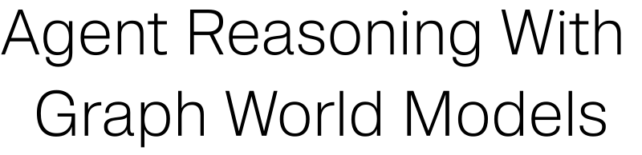
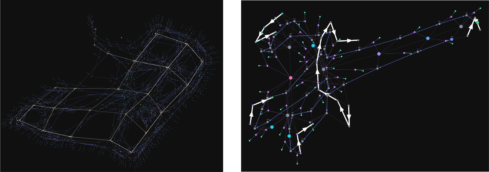
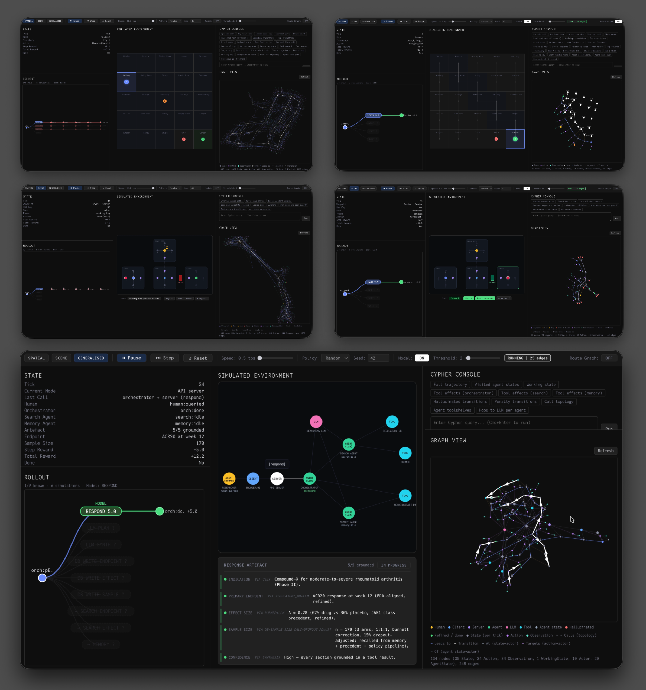
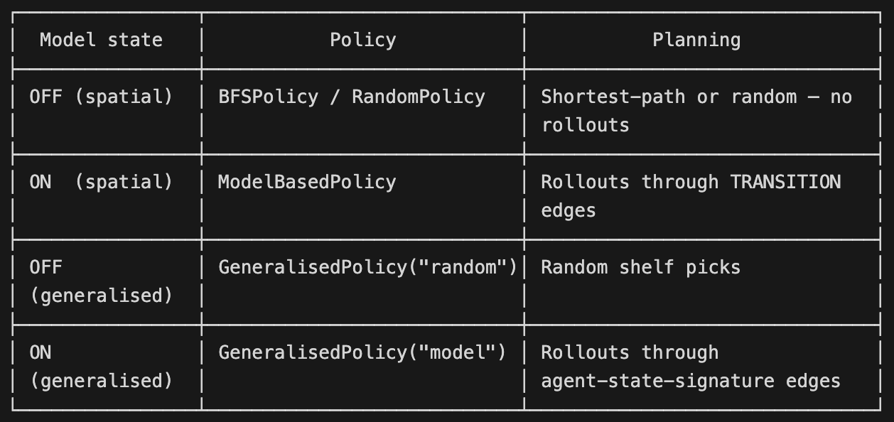

<div align="center">
<picture>
  <source media="(prefers-color-scheme: dark)" srcset="assets/title-dark.svg">
  <source media="(prefers-color-scheme: light)" srcset="assets/title-light.svg">
  
</picture>
</div>

<p align="center">
  
  
</p>

## Summary

This is a repo of supporting material for the 'Agent Reasoning With Graph World Models' talk from Neo4j's NODES AI conference (April 15th 2026). The primary aim of the talk was to introduce the concept of using world models in systems that use LLM-based agents beyond strictly spatial domains. The example code demonstrates three scenarios, two spatial and one 'generalised' that reflects a toy example of a person interacting with agents to achieve a goal. This was not an RL talk per se, and so a very basic approach to learning is implemented just to demonstrate how a graph data model can be transformed into a functional world model simply by storing statistics as edge properties. The ‘model’ is purely captured by the set of (`visit_count`, `r_sum`, `r_mean`) tuples on TRANSITION edges in the graph.

<p align="center">
<picture>
  <source type="image/png" media="(max-width: 639px)" srcset="assets/img-column.png">
  
</picture>
</p>

*[left / top] a state-action space in a spatial environment with a random policy, and [right / bottom] a state-action space in a generalised environment with a simple model-based policy.*

## Introduction

Human agents reason about their environments and how actions in their environments can to lead to progression toward achieving goals. 

The ability to perceive and interpret the content and structure of the environment is a  foundational aspect of this.  But beyond forming this underlying structural representation, the ability to reason based on knowledge of the causal effects of actions is a key skill that enables people to achieve multi-step goals in complex environments.

While this has a clear link with the physical world, a world model itself is not a representation of a physical environment per se, it is a compressed representation of state transitions and the causal effects of actions in the context of some underlying environmental context.

The key point is that a world model is comprised of both a compressed representation of the structure and content of the environment, and a compressed representation of the causal effects of actions in that environment, with the concepts and techniques underpinning this being applicable to any application that uses agents. 


*“LLMs learn the structure of language. World Models learn the structure of causality.”*
-	McCormick, P. and De Witte, P. (2026)


## Running the demo


In terms of the database, running the demos should result in three disconnected subgraphs, one for each demo. Running the demos is primarily controlled via the speed and model toggle. Transitions between 'rooms' (grid cells) in the first demo are then used as the basis for representing environmental structure in the other two demos.

[IMG]


A short guide to launching the graphical demo locally.

### Prerequisites

- Python 3.11+ with `pip install -r requirements.txt`
- Node.js (for the Vite UI — dependencies auto-install on first run)
- Docker (for Neo4j)

### 1. Start Neo4j

```bash
docker compose up -d
```

Bolt endpoint: `bolt://localhost:7687` (user `neo4j`, password `password`).
Browser UI: http://localhost:7474.

### 2. Launch the demo

```bash
python -m graph_world_model.graphical_demo --seed 42
```

This starts the FastAPI backend (port `8765`), spawns Vite (port `5175`), and opens the UI in your browser.

### CLI options

| Flag | Default | Notes |
| --- | --- | --- |
| `--policy` | `random` | `random` or `bfs` |
| `--seed` | `42` | Seed for world + policy RNG |
| `--model-threshold` | `2` | `min_visits` before the world model trusts a TRANSITION edge |
| `--max-steps` | `500` | Episode length cap |
| `--port` | `8765` | Backend (FastAPI/WebSocket) port |
| `--vite-port` | `5175` | Frontend dev-server port |
| `--no-browser` | off | Skip auto-opening the browser |
| `--serve-static` | off | Serve `ui/dist` from the backend (requires `npm run build` in `ui/`) |
| `--neo4j-uri` / `--neo4j-user` / `--neo4j-password` | `bolt://localhost:7687` / `neo4j` / `password` | Override if Neo4j isn't on defaults |

### UI

- **Play / Pause / Step / Reset** drive the simulation loop.
- **Environment** switcher toggles between the `spatial`, `scene`, and `generalised` contexts — each writes its own isolated subgraph into Neo4j.
- **World model** toggle rebuilds the policy as a model-based planner using the learned TRANSITION statistics.
- **Cypher console** runs ad-hoc queries against the active context.



### Shutdown

`Ctrl+C` in the terminal stops the backend and terminates the Vite subprocess. Neo4j keeps running until you `docker compose down`.


## Model

### Overview

The basic principle of using graph data as a basis for a world model is demonstrated. This includes a very simple RL implementation for giving agents the ability to decide on actions to take at the application / ‘harness’ level. This should not to be confused with ‘agent RL’ in terms of post-training an LLM itself. The nuance of this is discussed further in ‘Next Steps’.

A classical approach to guiding agent actions in an environment is the ‘Dyna’ architecture (Sutton, 1990), with ‘Dyna-Q’ being a concrete implementation that includes ‘Q-learning’ (Sutton & Barto, 2018). Here ‘Q’ refers to the ‘quality’ of an action in a given state given some quantifiable goal, as measured by computing expected cumulative reward.

$$Q(s,a)$$

Our toy world model learns transition dynamics $T(s' \mid s, a)$ and $R(s, a)$ from the graph (the transition function and the reward function), i.e. the model reads aggregate TRANSITION edges between (‘Room’) nodes to answer:
  - "If I do action A in room S, where do I end up and what reward do I get?"
  - "Which action from room S gives the best expected return over H steps?"

This is the core of the Dyna-Q architecture - the agent imagines rollouts
through the learned model and picks the action with the highest value.

Here however, the approach we are actually using is Model-Based Monte Carlo Q-Estimation as a rough approximation of Dyna-Q.

“Monte-Carlo Q-value estimation is a reinforcement learning technique that computes expected cumulative rewards by averaging sampled future returns over state–action pairs.”

“Monte-Carlo Q-Value Estimation constitutes a foundational class of algorithms within reinforcement learning (RL) for estimating the... Q-value...”


“Monte-Carlo Q-value estimation centers on the empirical averaging of sampled future returns to estimate action values... where $(r_i^{m}, s_i'^{m}, a_i')$ are sampled from environment dynamics and the current policy.”

$$Q(s,a) \approx \frac{1}{N} \sum_{i=1}^{N} \left[ r_i + \gamma \, Q(s_i', a_i') \right]$$

(Emergent Mind [online])


To summarise then, the agent imagines the outcome of each possible action, runs forward rollouts, and picks the action with the highest expected return.


### Details

$T(s' \mid s, a)$ — the transition function. "If I'm in state $s$ and take action $a$, what's the probability of ending up in state $s'$?" Derived from `visit_count` on TRANSITION edges:

$$p(s') = \frac{\text{visit\\_count}(s, a, s')}{\sum_{s''} \text{visit\\_count}(s, a, s'')}$$

$R(s, a)$ — the reward function. "If I'm in state $s$ and take action $a$, what reward do I expect?" Stored as `r_mean` on each TRANSITION edge.

Both are learned from counts and running averages on the same TRANSITION edges. The model doesn't separate them into different structures — one edge gives you both "where will I go" and "what will I get."


### Implementation

In practice in the demo, the model reads aggregate TRANSITION edges to model the environment dynamics.

    Each TRANSITION edge stores:
      - action: direction-qualified key like "move_north"
      - visit_count: how many times this (room, action) -> next_room was observed
      - r_mean: average reward for this transition

The model uses these to simulate ‘imagined’ rollouts  and to then evaluate candidate actions by their expected return.

`WorldModel.transition` queries $T(s' \mid s, a)$ to then return `[(next_room, probability, r_mean)]`.

Probability is then simply derived from visit counts. Only transitions observed
at least min_visits times are returned — low-evidence edges are treated as ‘unknown’.

The number shown on each action label in the rollout panel is its Q-value — the model's estimate of the expected discounted total reward if you take that action from the current agent-state and then follow the (‘greedy’) best known action for up to 4 more steps.

For each candidate action $a$ from state $s$, `WorldModel.evaluate_action` runs `n_rollouts = 6` imagined rollouts and averages their returns:

$$Q(s, a) = \frac{1}{6} \sum_{k=1}^{6} G^{(k)}$$

$$G = r_0 + \gamma \, r_1 + \gamma^2 \, r_2 + \gamma^3 \, r_3 + \gamma^4 \, r_4$$

with $\gamma = 0.95$ and horizon $= 5$ hops,

so, rollouts sample from a learned $\hat{T}(s' \mid s, a)$ and $\hat{R} = \text{r\\_mean}$,

with step 0 being a sample of the first transition,

(see `WorldModel.best_action`). 


Run one imagined rollout: take first_action, then pick the best known action at each subsequent step for the remaining horizon.

This is the core of the world model — the agent literally imagines "what would happen if I went north? then what? then what?" by sampling from learned transition probabilities.

The key control in the demo is whether the world model is ON or OFF:



TRANSITION edges are still recorded when the model is OFF — only the action-selection mechanism changes.


Refer to `WorldModel.md` for further information.


## Notes

There are some nuances with this implementation to be mindful of. One quirk is that in the spatial examples a ‘Room’ is effectively a grid cell, with this abstraction then being generalised to topological location in the ‘non-spatial’ example. This ‘Room’ abstraction quickly loses meaning, however exactly what ‘topological location’ should mean is highly context dependent. This is particularly true where you have a graph data model that includes a subset of nodes that should be traversable by an agent in a ‘world model’ context and another subset for which there is not a practical or semantically meaningful relationship with a ‘world model’ representation.

The visualisations of state-action spaces in the ‘Graph View’ panel in the demo are really just a starting point and left ‘as-is’ include some misleading information. For example, while the graph ‘grows’ over time, edges do not always correspond with temporal order, which leads to issues like a misleading visualisations of the observation-action-state subgraphs. The visualisation logic should be iterated on given your actual scenario and the specific information you would like the visualisation to convey.


## Next steps

The obvious next step is to link the ‘generalised’ demo with an actual LLM agent system. In practice this requires some upfront work to think though how you will measure reward and more generally what the graph structure should be that effectively expresses the ‘world’ you are trying to represent.

A key consideration here is if you have a ‘world model’ implementation running at the application level, and you are also using LLMs for agent reasoning, you then have two different (potentially conflicting) reasoning engines operating in the same system. Probably the correct direction would be to use the signal generated by the world model as contextual information passed to the LLMs from agent calls, however this is beyond the scope of the current demo.


*“This rabbit hole goes as deep as you want it to. But it’s World Models all the way down."*
-	McCormick, P. and De Witte, P. (2026)


## References

Emergent Mind. (2025, September 2). Monte-Carlo Q-value estimation [online]. Available at: https://www.emergentmind.com/topics/monte-carlo-q-value-estimation

McCormick, P. and De Witte, P. (2026). World Models: Computing the Uncomputable [online]. Available at: https://www.notboring.co/p/world-models

Sutton, R. S. (1991). Dyna, an integrated architecture for learning, planning, and reacting. ACM Sigart Bulletin, 2(4), 160-163.

Sutton, R. S., & Barto, A. G. (2018). Reinforcement learning: An introduction (2nd ed.). MIT Press.